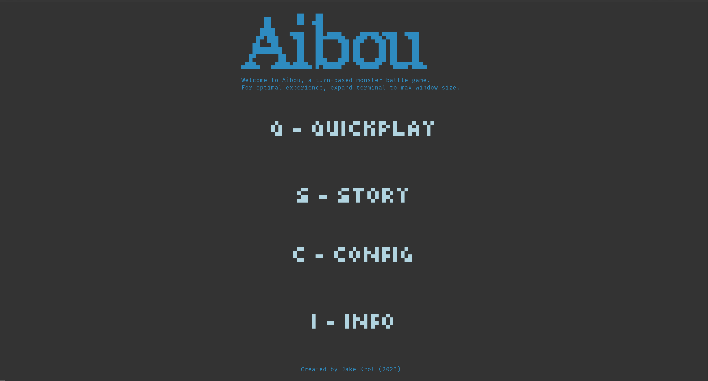
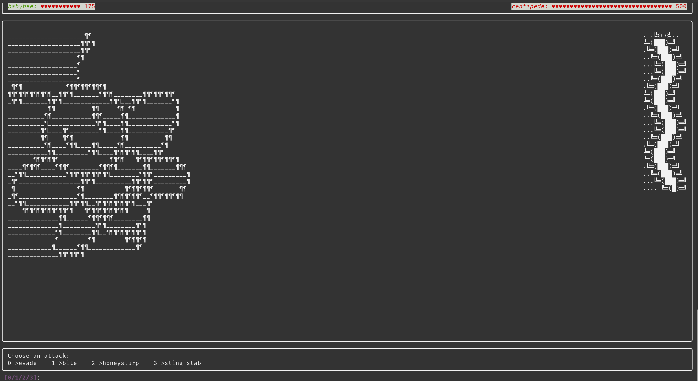

# Aibou

A command-line-interface game built with python. The gameplay is turn-based with key press quick-time-events (QTEs) that determine the efficacy of chosen moves. 





## Quickstart

``` bash
pip install aibou
python -m aibou
```

## Linux

``` bash
# keyboard module requires root
sudo su
pip install aibou
python -m aibou
```

## Info

[How to play](aibou/docs/how-to-play.md)

[Developer guide](aibou/docs/dev-notes.md)

Authored by [Jacob Krol](https://github.com/jakekrol)

### Developer timeline

- Core game development: Winter break of 2022-2023
- Develop and publish python package: Winter break of 2023-2024
